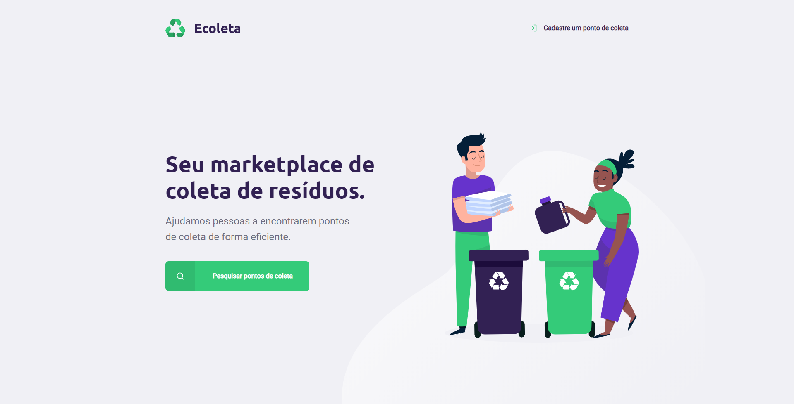

    
    <h2 align="center">
        Ecoleta
    </h2>
    

        Create a application to local recycling.
    

 

# About the project

Create a application to local recycling (_Ecoleta_)

# Features

- Search and identify local recycling
- Companies add local recycling by type
- **Frontend Tecnologies**: HTML, CSS, Javascript
- **Backend Tecnologies**: Node, Express, nodemon, nunjucks and SQLite

# Getting Started

### Requisites

- The [NodeJS](https://nodejs.org/) is **required** to be able to run this project.

### Instalation

**1.** Clone repository:

`git clone git@github.com:rpradosilva/rocketseat-clone-challenge.git`

### **2.** Install packages:

`npm install`

### **3.** Run project:

`npm start`

### **4.** Live Preview:

`localhost:3000`

# License

This project is protected by the MIT license. See the file [LICENSE](/LICENSE) for more details.
 

---

### **Developed by** 
