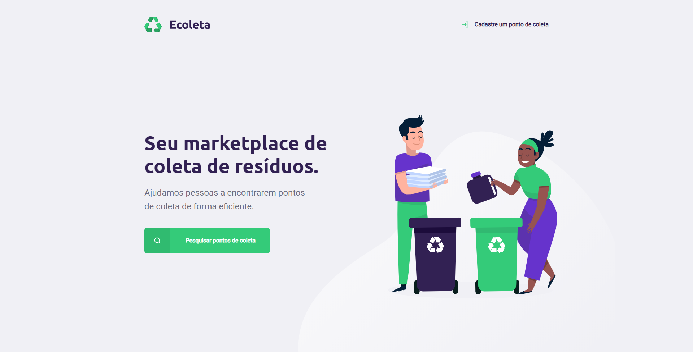

<div align="center">
    
    <br><br>
    
[](https://rocketseat.com.br)
<br>
</div>  


# :pushpin: Proposal
### Create a application to local recycling (*Ecoleta*)

> Search and identify local recycling

> Companies add local recycling by type

> **Frontend Tecnologies**: HTML, CSS, Javascript

> **Backend Tecnologies**: Node, Express, nodemon, nunjucks and SQLite

<div align="center">
    
</div>

## :runner: Getting Started

**You need Node installed.**

### **1.** Clone repository:

```git clone git@github.com:rpradosilva/rocketseat-clone-challenge.git```

### **2.** Install packages:

```npm install```

### **3.** Run project:

```npm start```

### **4.** Live Preview:

```localhost:3000```

## :memo: License

This project is protected by the MIT license. See the file [LICENSE](/LICENSE) for more details.

---

Made with ♥ by [Rafael Prado](http://rprado.design)
